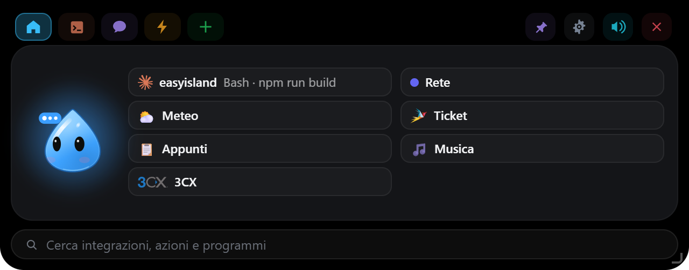
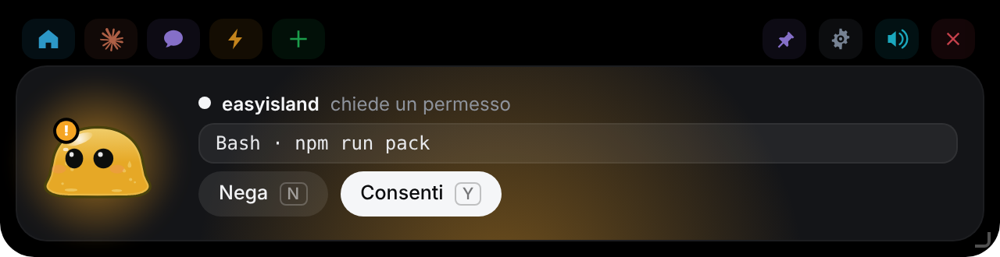
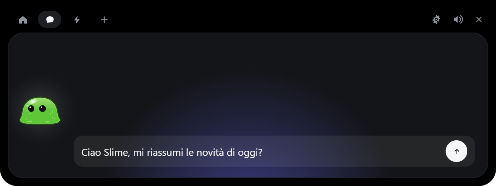
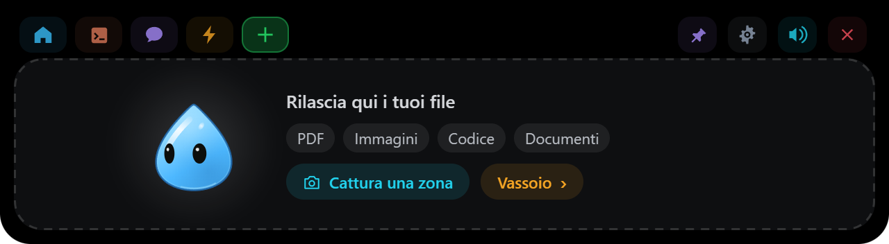
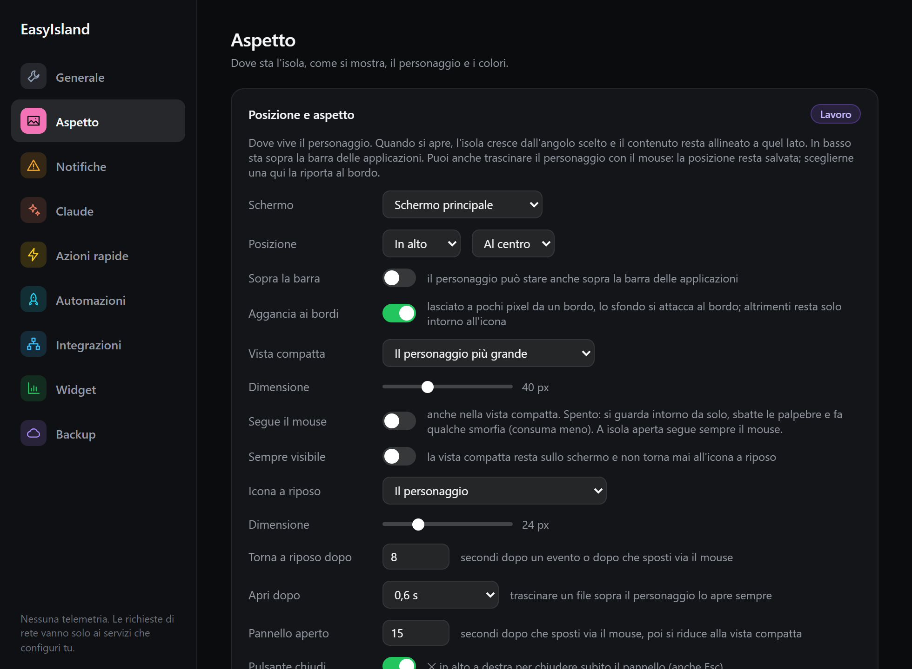

<div align="center">


# EasyIsland

**Su un PC Slime non ha un notch, quindi vive in cima al tuo schermo.**

Approva i permessi di Claude Code, guarda la sessione lavorare, rilascia un file, chatta con Claude, tieni d'occhio i tuoi servizi: tutto senza interrompere quello che stai facendo.


</div>


---

## Installazione

**Il modo più semplice:** scarica `EasyIsland-Windows-X.Y.Z-setup.exe`
dall'[ultima release](https://github.com/EdoardoDevelop/easyisland/releases/latest)
ed eseguilo. L'installazione è solo per l'utente corrente: nessuna richiesta di
amministratore. L'installer non è ancora firmato, quindi Windows SmartScreen
mostra un avviso: clicca **Ulteriori informazioni → Esegui comunque**. Poi vai a
[Dopo l'installazione](#dopo-linstallazione). Gli aggiornamenti successivi
arrivano da soli (vedi [Aggiornare](#aggiornare)).

**Oppure compilalo sul tuo PC**, con i passi 1–4 qui sotto: alla fine si ottiene
lo stesso installer `.exe`. Ci vogliono circa 15–20 minuti la prima volta (quasi
tutti di download e compilazione), pochi minuti le volte successive.

### 1. Strumenti (solo la prima volta)

Apri **PowerShell** e installa i quattro strumenti con `winget`, già presente in
Windows 10/11:

```powershell
winget install --id Git.Git -e
winget install --id OpenJS.NodeJS.LTS -e
winget install --id Rustlang.Rustup -e
winget install --id Microsoft.VisualStudio.2022.BuildTools -e --override "--wait --passive --add Microsoft.VisualStudio.Workload.VCTools --includeRecommended"
```

| Strumento | A cosa serve |
|---|---|
| Git | scaricare il progetto |
| Node.js (LTS, 20 o più recente) | compilare l'interfaccia |
| Rust (rustup) | compilare l'app e il relay `easyisland-hook.exe` |
| Visual Studio Build Tools, carico "Sviluppo di applicazioni desktop con C++" | il linker e le librerie di Windows che usa Rust |

L'ultimo comando scarica alcuni GB e può richiedere parecchi minuti. WebView2,
che disegna l'interfaccia, è già incluso in Windows 10/11.

**Chiudi e riapri PowerShell** al termine, così i nuovi comandi (`git`, `npm`,
`cargo`) vengono trovati. Per controllare:

```powershell
git --version; node --version; cargo --version
```

### 2. Scarica il progetto

```powershell
cd $HOME
git clone https://github.com/EdoardoDevelop/easyisland.git
cd easyisland
```

> Se le modifiche più recenti sono ancora su un branch di sviluppo e non in
> `main`, passa a quel branch: `git checkout <nome-del-branch>`.

### 3. Compila l'installer

```powershell
npm install
npm run pack
```

`npm run pack` compila il relay, l'interfaccia e l'app, e alla fine lascia due
file nella cartella `release\`:

```
EasyIsland-Windows-X.Y.Z-setup.exe    l'installer con la versione
EasyIsland-Windows-setup.exe          lo stesso file con il nome fisso
```

### 4. Installa

```powershell
start .\release\EasyIsland-Windows-setup.exe
```

L'installer non è firmato, quindi Windows SmartScreen mostra un avviso: clicca
**Ulteriori informazioni → Esegui comunque**.

### Dopo l'installazione

EasyIsland si avvia e Slime ti saluta; da lì in poi lo trovi nel menu Start e
nell'area di notifica. Dall'icona di EasyIsland nell'area di notifica →
**Impostazioni…**:

1. **Claude Code → Installa hook…** per vedere le sessioni nell'isola (vedi sotto).
2. **Chat con Claude**: lascia "Abbonamento Claude" se usi Claude Code con il tuo
   piano, oppure inserisci una chiave API.
3. **Posizione e aspetto**: l'angolo e l'icona che preferisci.

### Aggiornare

**Da solo:** all'avvio e poi una volta al giorno EasyIsland guarda se su GitHub
c'è una release più recente. Se c'è, l'isola mostra **Aggiornamento
disponibile** con **Installa** / **Più tardi**: niente si installa senza il tuo
clic. L'aggiornamento è firmato e l'app ne verifica la firma prima di eseguirlo;
installando, si chiude e si riapre da sola. Si controlla anche a mano, o si
spegne il controllo, in **Impostazioni → Generale → Aggiornamenti**.

**Se l'hai compilato tu:**

```powershell
cd $HOME\easyisland
git pull
npm install
npm run pack
start .\release\EasyIsland-Windows-setup.exe
```

L'installer sostituisce la versione precedente; impostazioni e chiavi restano.

### Disinstallare

Prima, in **Impostazioni… → Claude Code**, clicca **Disinstalla hook…**: il
disinstallatore volutamente non tocca il `settings.json` di Claude Code. Poi
**Impostazioni di Windows → App → App installate → EasyIsland → Disinstalla**.

### Se qualcosa va storto

| Errore | Soluzione |
|---|---|
| `npm`, `cargo` o `git` "non riconosciuto" | chiudi e riapri PowerShell dopo l'installazione degli strumenti |
| `linker 'link.exe' not found` | mancano i Visual Studio Build Tools con il carico C++: rilancia l'ultimo comando `winget` del passo 1 |
| `error: toolchain 'stable-x86_64-pc-windows-msvc' is not installed` | `rustup default stable-msvc` |
| l'installer viene bloccato da Defender | è il falso positivo descritto sopra: usa "Esegui comunque", oppure lancia direttamente `target\release\easyisland.exe` |
| Slime non compare | guarda nell'area di notifica (la freccia ^ accanto all'orologio) e il log in `%LOCALAPPDATA%\EasyIsland\easyisland.log` |
| le Impostazioni | sono divise in pagine (Generale, Aspetto, Notifiche, Claude, Azioni rapide, Integrazioni, Widget, Backup) nel menu a sinistra; la finestra ricorda l'ultima aperta |
| vuoi aprire le impostazioni senza l'area di notifica | `"%LOCALAPPDATA%\EasyIsland\easyisland.exe" --settings` (anche come collegamento) |

## Come si usa







_Schermate generate dall'anteprima con `node scripts/screenshots.mjs` (serve `npm run dev` acceso)._

| Cosa fai | Cosa succede |
|---|---|
| Porti il mouse sull'icona di Slime (in alto al centro, o nell'angolo che hai scelto) | Slime si ingrandisce (o resta sempre così, con **Sempre visibile**) |
| Clicchi su Slime, o lasci il mouse sopra per un attimo se "Apri dopo" lo prevede | Si apre l'isola, allineata a quel lato |
| Trascini Slime tenendo premuto il tasto sinistro | Si sposta dove lo lasci, e la posizione resta salvata nel profilo |
| Clicchi su Slime | Si infastidisce. Tre volte di fila e gli gira la testa |
| Lasci il puntatore su Slime per due secondi | Cuori |
| Trascini un file sull'isola | Si apre anche se è impostata "solo con un clic": Slime diventa una scatola, lo inghiotte e poi si offre di rispondere a domande sul file |
| `Esc`, o la ✕ in alto a destra | Chiude subito l'isola, senza aspettare i secondi della chiusura automatica |
| 📌 in alto a destra | **Tieni aperta**: l'isola non si chiude più da sola finché non la togli (Esc e ✕ la chiudono comunque) |
| Scrivi un calcolo nella chat, es. `840 + 22%` o `15% di 840` | Compare subito il risultato; **Invio** lo copia negli appunti, **Ctrl+Invio** chiede comunque a Claude. Il calcolo è fatto in locale, senza Claude |
| Rilasci uno ZIP | Oltre a "Fai una domanda" c'è **Estrai…**: vedi cosa contiene e lo estrai in una cartella nuova accanto all'originale, in Download o sul Desktop |
| Scheda **+** → **File caricati** | La cronologia dei file rilasciati sull'isola (le copie tenute per una settimana): chiedi a Claude, apri, mostra nella cartella, elimina uno o tutti. Gli originali non vengono toccati |
| Icona nell'area di notifica | Apri, Impostazioni…, Pausa, Esci |

Tutto il resto succede da solo: una richiesta di permesso di Claude Code apre
l'isola con **Nega / Consenti**, una sessione finita mostra cosa ha fatto e le
tue integrazioni stanno nelle pillole colorate accanto a Slime. Non c'è un
numero massimo di integrazioni e widget: l'isola si allunga per mostrare tutte
le pillole e tutto il testo della scheda in primo piano (fino a circa 540 px,
poi le pillole scorrono).

## Posizione e aspetto

**Impostazioni… → Posizione e aspetto** decide dove vive Slime e quanto si fa notare:

- **Posizione**: in alto o in basso, a sinistra, al centro o a destra. Quando si
  apre, l'isola cresce dall'angolo scelto e il contenuto resta allineato a quel
  lato. Puoi anche **trascinare Slime** con il mouse dove vuoi: al rilascio la
  posizione resta salvata nel profilo, e il lato da cui si apre l'isola viene
  scelto da solo (il terzo e la metà dello schermo in cui lo lasci), così il
  pannello cresce verso l'interno. Vicino a un bordo o al centro si aggancia.
  Scegliere di nuovo una posizione qui lo riporta al bordo.
- **Sopra la barra**: Slime può stare anche sopra la barra delle applicazioni
  (spento: resta sopra di essa, nell'area di lavoro).
- **Aggancia ai bordi**: lasciato a pochi pixel da un bordo dello schermo, lo
  sfondo si attacca al bordo con gli angoli squadrati da quel lato; altrimenti è
  una bolla solo intorno all'icona. Spento: si attacca solo in alto al centro.
- **Vista compatta**: uno Slime più grande e animato, oppure la barra compatta
  con le integrazioni, con dimensione regolabile.
- **Segue il mouse**: se attivo, anche nella vista compatta il personaggio
  guarda il cursore. Spento (predefinito): si guarda intorno da solo, sbatte le
  palpebre e ogni tanto fa una smorfia, e consuma meno. A isola aperta segue
  sempre il mouse.
- **Sempre visibile**: la vista compatta resta sempre sullo schermo e non torna
  mai all'icona a riposo. Costa un po' di CPU (Slime è animato): sul portatile a
  batteria valuta se spegnerla.
- **Icona a riposo** e **Torna a riposo dopo** (solo se *Sempre visibile* è
  spenta): Slime fermo, un pallino con il colore dello stato, oppure nulla (solo
  una striscia invisibile sul bordo), e dopo quanti secondi tornarci. L'icona a
  riposo è un'immagine ferma: non consuma CPU.
- **Apri dopo**: quanto tenere il mouse sopra prima che si apra, oppure **solo
  con un clic**. Trascinare un file sopra Slime lo apre sempre.
- **Pannello aperto**: dopo quanti secondi dall'uscita del mouse il pannello si
  riduce alla vista compatta.
- **Pulsante chiudi**: la ✕ in alto a destra del pannello per chiuderlo subito.
- **Schermo intero**: durante video, giochi e presentazioni Slime sparisce; le
  richieste di permesso compaiono comunque.

Per provare le combinazioni senza compilare l'app (basta Node, niente Rust):

```powershell
npm install
npm run ui
```

Si apre il browser su un finto desktop: il riquadro tratteggiato è la finestra
di EasyIsland. Le impostazioni si cambiano nell'indirizzo, per esempio
`http://localhost:1420/?anchorV=bottom&anchorH=left&iconStyle=dot&iconSize=32&hoverSize=48&openDelay=1&revealDuration=3&bg=dark`.

## Azioni rapide e scorciatoie

**Impostazioni… → Azioni rapide** crea i pulsanti della scheda ⚡ dell'isola:

| Tipo | Cosa fa |
|---|---|
| **Chiedi a Claude** | manda un prompt salvato, applicato al testo copiato negli appunti o al file rilasciato sull'isola |
| **Script** | esegue comandi PowerShell o del Prompt dei comandi, nascosti, e mostra l'output nell'isola (con *Interrompi*, timeout di 5 minuti). Parte **solo dopo un clic**; con "Chiedi conferma" mostra prima i comandi |
| **Programma / cartella** | avvia un programma con i suoi argomenti (es. `mstsc /v:server01`) o apre una cartella |
| **Link** | apre un indirizzo nel browser |

**Suggerimenti per l'app in uso**: in cima alla scheda ⚡ compaiono azioni pronte
per l'app che stai usando, applicate al testo che hai selezionato: per Outlook
*Riassumi la mail*, *Scrivi una risposta*; per Excel *Spiega questi dati*; per
Word *Correggi*, *Rendi più formale*; per il browser *Riassumi*, *Traduci*; per
l'editor di codice *Spiega*, *Trova bug*; per il terminale *Spiega l'errore*; per
Teams e i PDF; per qualsiasi altra app *Riassumi*, *Traduci*, *Correggi*. Al clic
EasyIsland copia la selezione (e poi rimette negli appunti quello che c'era),
quindi apre la chat con il testo allegato. Si spegne in Azioni rapide.

Ogni azione si può riordinare con ↑ ↓ ed eliminare con ✕. L'icona si sceglie
con un clic sul riquadro a sinistra del nome, tra una cinquantina di icone
disegnate nel codice (terminale, cartella, sito, server, rete, lucchetto,
calendario, posta…); prende il colore dell'azione.

**Scorciatoie globali**, valide in ogni app (modificabili):

- `Ctrl+Alt+Shift+M` apre Slime sulle azioni (o sulla chat se non ce ne sono);
- `Ctrl+Alt+K` apre la chat con il testo copiato già allegato: scrivi la domanda;
- `Ctrl+Alt+H` apre la cronologia degli **Appunti** (se l'integrazione è accesa);
- ogni azione può avere la sua scorciatoia, es. `Ctrl+Alt+E` per "Spiega errore".

Se una scorciatoia è già usata da un'altra app, le Impostazioni lo segnalano.
Le azioni appartengono al profilo attivo; le scorciatoie Apri/Chiedi al PC.

## Integrazioni

**Impostazioni… → Integrazioni** accende le integrazioni, una per tipo, che
compaiono come pillole accanto a Slime. Chiavi, token e indirizzi stanno in
Gestione credenziali di Windows.

| Integrazione | Cosa mostra |
|---|---|
| **GitHub, Vercel, Stripe, Resend, Notion, Cal.com, n8n** | l'attività del servizio (deploy, pagamenti, email, prenotazioni, esecuzioni), con la chiave del servizio |
| **Zammad** | ticket assegnati a te, non assegnati e in escalation; avvisa quando arriva un nuovo ticket da assegnare. Indirizzo e token di accesso (Profilo → Token di accesso, permesso `ticket.agent`) |
| **Outlook** | mail non lette e appuntamenti di oggi e domani da Outlook classico già aperto (non lo avvia mai); avvisa qualche minuto prima di una riunione. Il nuovo Outlook non è supportato |
| **Stato del PC** | spazio sul disco di sistema (arancione sotto la soglia, 10 %, rosso sotto il 5 %), memoria, batteria, da quanto è acceso, riavvio richiesto da Windows. Pulsante **Copia info PC**: nome, utente, Windows, modello, numero di serie, IP e MAC negli appunti, pronti per un ticket |
| **Sicurezza** | antivirus (Defender o un altro, dal Centro sicurezza di Windows), età delle firme, ultima scansione, firewall, minacce rilevate |
| **Rete** | Wi-Fi o cavo, IP locale e pubblico (api.ipify.org, al massimo ogni 15 minuti), VPN attive, latenza verso 1.1.1.1; avvisa se internet non risponde o è lento |
| **Meteo** | meteo attuale di una città (Open-Meteo, gratuito e senza chiave); avvisa se è probabile pioggia nelle prossime ore |
| **Appunti** | gli ultimi 30 testi copiati, più quelli fissati: clic per incollarli nell'app in primo piano, oppure copia, trasforma (MAIUSCOLO, minuscolo, una riga, senza spazi, JSON, URL), fissa, elimina. Solo in memoria, mai su disco; ciò che i gestori di password segnano come privato non viene registrato |
| **Musica** | cosa sta suonando in qualsiasi app che compare nei controlli multimediali di Windows (Spotify, il browser, Lettore multimediale…), con copertina, avanzamento e ⏮ ⏯ ⏭. Tutto in locale |

Ogni integrazione può stare tra le pillole della panoramica oppure in alto
nell'isola come **scheda**, con il suo nome o con un'icona a scelta ("Mostra
come"). Aprendo la scheda si vede solo quell'integrazione; le pillole restano
sulla scheda ⌂.

Quali integrazioni sono accese, e come sono mostrate, dipende dal profilo.

## Widget

**Impostazioni… → Widget** aggiunge controlli ripetibili, quanti ne servono
(un sito per cliente, un server per sede…), senza scrivere codice:

| Tipo | Cosa controlla |
|---|---|
| **Calendario** | i prossimi appuntamenti da un link ICS (Google Calendar, Outlook.com, iCloud), senza login; avvisa qualche minuto prima. Il link è segreto e sta in Gestione credenziali |
| **Scadenza domini** | i giorni alla scadenza di uno o più domini (RDAP, o WHOIS per i registri che non lo hanno, come .it) |
| **Sito web** | che un indirizzo risponda (stato 2xx/3xx o quello che indichi) e in quanto tempo |
| **Certificato HTTPS** | i giorni alla scadenza del certificato di un dominio: arancione sotto la soglia (30 giorni), rosso sotto i 7 o se scaduto |
| **Ping** | che un host risponda al ping (senza diritti di amministratore) |
| **Porta TCP** | che una porta sia aperta, es. 3389 (Desktop remoto), 22, 443 |
| **Servizio Windows** | che un servizio locale sia in esecuzione, es. `Spooler` |
| **API JSON** | qualsiasi API: scegli i campi da mostrare (percorso tipo `data.items[0].stato`) e una regola di avviso (es. `aperti > 10`). Le intestazioni segrete (token, chiavi) vanno in Gestione credenziali |

Quando un controllo (widget o integrazione come Stato del PC, Rete, Outlook…)
passa da OK a problema, la pillola prende un badge, Slime suona e l'isola si fa
vedere (secondo le regole di notifica del profilo). Il pulsante ▶ prova un widget
subito. I controlli si fermano con EasyIsland in pausa e diventano tre volte più
radi a batteria. I widget appartengono al profilo.

## Davanti al cliente

**Impostazioni… → Notifiche → Davanti al cliente**: Slime si fa da parte quando
qualcuno potrebbe vedere il tuo schermo.

- **Durante le chiamate**: microfono o webcam in uso da qualsiasi app (Teams,
  Zoom, Meet nel browser, Webex…). EasyIsland lo legge da dove Windows annota chi li
  sta usando, senza bisogno dell'API di Teams.
- **Durante l'assistenza**: qualcuno è collegato a questo PC (Desktop remoto,
  Assistenza rapida, TeamViewer), più i programmi che aggiungi tu.
- **A mano**: icona nell'area di notifica → **Davanti al cliente**.
- **Cosa fa**: nasconde Slime e silenzia i suoni (le richieste di permesso di
  Claude Code compaiono comunque), oppure solo silenzio.

## Messaggi dagli script

Qualsiasi script, attività pianificata, flusso n8n o programma può mostrare un
messaggio sull'isola:

```powershell
& "$env:LOCALAPPDATA\EasyIsland\bin\easyisland-hook.exe" notify "Backup" "Completato in 4 minuti" --stato ok
```

`--stato` è `ok`, `avviso`, `errore` o `info`; `--apri https://…` aggiunge un
pulsante con un link; `--help` mostra l'aiuto. Esce con 0 se il messaggio è
arrivato e con 2 se EasyIsland non è in esecuzione, quindi uno script non resta mai
bloccato. Valgono le regole di notifica del profilo. In **Impostazioni… →
Notifiche** c'è il comando pronto da copiare e un pulsante **Prova**.

## Profili, tema e backup

**Impostazioni… → Profilo**: ogni profilo (di partenza *Lavoro*, *Casa* e
*Concentrazione*) ha le sue integrazioni, posizione, aspetto, suoni, tema e
regole di notifica. Le sezioni con l'etichetta viola si salvano nel profilo
attivo.

- Si cambia profilo dalle Impostazioni o dal menu dell'icona nell'area di
  notifica (**Profilo ▸**).
- **Cambio automatico**: ogni profilo può avere regole su rete Wi-Fi, giorni e
  orario (es. *Lavoro* sulla Wi-Fi dell'ufficio, lun–ven 8–18). Ogni minuto
  EasyIsland attiva il primo profilo che corrisponde; una scelta fatta a mano resta
  finché la situazione non cambia.
- **Notifiche**: tutto, solo avvisi, oppure solo le richieste di permesso
  (com'è *Concentrazione* all'inizio).
- **Tema**: il personaggio (**Slime**, **Goccia** o **EasyTech**), il suo
  colore, colore e opacità dell'isola, **sfondo a isola chiusa** (spento, a
  isola chiusa resta solo il personaggio, senza il cerchio o la barra), volume
  separato per avvisi, interfaccia ed emozioni. Slime è uno slime di gelatina verde che ondeggia quando si
  muove; Goccia è un piccolo spirito d'acqua azzurro, lucido, a forma di goccia;
  EasyTech è un cubo, a riposo con i colori del logo da cui è disegnato. Negli
  altri stati tutti prendono il colore dello stato (blu mentre lavora, ambra per
  un permesso, rosso per un errore…). EasyTech ha gli occhi su un lato, con le
  stesse espressioni, e segue il mouse come gli altri. Anteprima senza
  compilare: `npm run ui`, poi aggiungi `?character=drop` o `?character=cube`
  all'indirizzo.
- **Backup e trasferimento**: *Esporta…* salva tutte le impostazioni (profili
  compresi) in un file JSON nella cartella Documenti; *Importa…* le carica su un
  altro PC. Le chiavi API non sono mai nel file: vanno reinserite.

## Claude Code



Apri **Impostazioni… → Claude Code → Installa hook…**. Vedi il diff esatto di cosa
cambierà in `%USERPROFILE%\.claude\settings.json` e il percorso della copia di
backup datata che verrà creata. Non viene scritto nulla finché non clicchi. I tuoi
hook non vengono mai toccati e la disinstallazione rimuove solo le voci di EasyIsland.

Il relay è un piccolo eseguibile, `easyisland-hook.exe`, copiato in
`%LOCALAPPDATA%\EasyIsland\bin\` all'avvio. Ha 300 ms per raggiungere EasyIsland ed esce
in modo pulito se l'app è chiusa, lenta o crashata: **una sessione di Claude Code
non viene mai bloccata né rallentata da EasyIsland.** Se nessuno risponde in tempo a
una richiesta di permesso, EasyIsland resta in silenzio e Claude Code la chiede nel
terminale come al solito.

Funziona da qualsiasi terminale: Windows Terminal, PowerShell, VS Code, Git Bash.

## Chat con Claude

**Impostazioni… → Chat con Claude** ti fa scegliere il motore della chat:

- **Abbonamento Claude (tramite Claude Code)**, il predefinito. Slime usa
  Claude Code installato sul PC (`claude -p`, nascosto, senza finestre) e il tuo
  abbonamento Pro o Max: nessuna chiave e nessun costo extra, ma le domande
  contano nei limiti d'uso del piano. Serve Claude Code installato e con il
  login fatto. Claude Code gira in una cartella vuota
  (`%LOCALAPPDATA%\EasyIsland\chat`), con gli hook disattivati e solo con ricerca
  web, lettura di pagine web e lettura dei file che rilasci.
- **Chiave API Anthropic**. Slime chiama direttamente l'API con la tua chiave,
  pagata a consumo dalla Console di Anthropic.

**Connettori in chat** (solo con "Abbonamento Claude"): Slime può usare i
server MCP che hai configurato in Claude Code per l'utente
(`claude mcp add --scope user …`), scegliendo quali profilo per profilo. Con
"chiedi conferma" (predefinito) ogni operazione su quel connettore compare
nell'isola con **Consenti / Nega**; disattivala solo per i connettori di sola
lettura. EasyIsland legge solo i nomi dei server, mai la loro configurazione. I
connettori di claude.ai non sono disponibili quando Claude Code gira in questo
modo.

Le chiavi stanno in **Gestione credenziali di Windows**, mai su disco e mai
nell'interfaccia: l'isola può solo chiedere se una chiave esiste. Lo stesso vale
per le chiavi di ogni integrazione.

Slime risponde in italiano, a meno che tu non gli scriva in un'altra lingua.
**Nuova chat**, a sinistra del campo di testo, dimentica la conversazione (e il
file o il testo a cui si riferiva) e ne comincia una da zero.

Con "Abbonamento Claude", EasyIsland cerca Claude Code nel `PATH`, in
`%USERPROFILE%\.localin` e nella cartella di npm; se non c'è un'installazione
a sé, usa la copia inclusa nell'app desktop di Claude
(`%APPDATA%\Claude\claude-code\<versione>`) o nell'estensione per VS Code,
sempre la versione più recente.

Nessuna telemetria. Le richieste di rete di EasyIsland vanno ai servizi che
configuri tu, più una sola altra: il controllo degli aggiornamenti, che legge un
file della release su GitHub (si spegne in Impostazioni → Generale →
Aggiornamenti).

## Automazioni

**Impostazioni… → Automazioni**: quando succede qualcosa, EasyIsland fa
qualcosa per te.

| Quando | Esempio |
|---|---|
| a un orario, nei giorni scelti | alle 9 dei giorni feriali apri Outlook e il gestionale |
| all'avvio (con il PC) | dopo 30 secondi passa al profilo Lavoro |
| quando sblocchi il PC | mostra un avviso con il promemoria del giorno |
| quando ti colleghi a una rete Wi-Fi | in ufficio apri la cartella condivisa |
| quando parte un programma | quando apri Teams, esegui l'azione "Silenzia" |
| quando colleghi una chiavetta o un disco | esegui lo script di backup |
| quando arriva un file in una cartella | avvisami delle nuove scansioni |
| quando un'integrazione o un widget segnala un problema o una novità | se il sito del cliente va giù, esegui lo script di controllo; nuovo ticket → avviso |

Si possono anche **chiedere a Claude a parole** nella chat (con l'abbonamento):
"ogni giorno feriale alle 9 apri Outlook e il gestionale", "quando colleghi una
chiavetta lancia il backup". Claude prepara l'automazione e l'isola te la mostra
(Quando… / Allora…) con **Consenti / Nega**: confermando, viene creata e accesa.

**Allora** è una sequenza di passi: un'azione rapida, un avviso nell'isola, il
cambio di profilo, aprire un programma o una cartella, aprire un link. Ogni
automazione si può limitare a un profilo e provare subito con **Prova ora**;
il **Registro** mostra le ultime esecuzioni. Partono senza chiedere, perché
le hai create tu, tranne gli script con "Chiedi conferma" e le domande a
Claude, che si aprono nell'isola. Con EasyIsland in pausa non parte niente.

### Claude può usare il PC

Con l'abbonamento (motore Claude Code), nella chat Claude può anche agire su
questo PC tramite EasyIsland: aprire programmi, cartelle e link, eseguire le
tue **azioni rapide** (anche gli script, di cui legge l'output), leggere lo
stato di PC, rete, meteo, posta e ticket, leggere o riempire gli appunti,
controllare la musica, mostrare un avviso, cambiare profilo. Esempi: "apri
Outlook e il portale fornitori", "com'è messo il PC?", "lancia il backup".

Tutto ciò che apre, esegue o cambia qualcosa chiede prima **Consenti / Nega**
nell'isola, con una descrizione chiara di cosa sta per fare. Claude non può
eseguire comandi qualsiasi: solo le azioni rapide che hai creato tu. Si spegne
in **Impostazioni → Claude → Claude può usare il PC**.

## Compilarlo da te

Per chi lavora sul codice. Gli strumenti sono gli stessi del passo 1 di
[Installazione](#installazione).

```powershell
npm install
npm run tauri dev      # l'app vera, con ricaricamento automatico dell'interfaccia
npm run ui             # solo l'interfaccia nel browser (non serve Rust)
npm run build          # controllo dei tipi + build dell'interfaccia
npm run pack           # crea l'installer e lo mette in release/
```

`npm run ui` serve il front end in un normale browser senza compilare nulla in
Rust, che basta per lavorare all'aspetto dell'isola (vedi "Posizione e aspetto").
Serve anche `dev/upload-preview.html`, che
ripete in loop tutta la coreografia del rilascio di un file: è l'unica parte
dell'interfaccia che altrimenti richiede un vero trascinamento da Esplora file.
Nessuna delle due pagine finisce nell'app.

`npm run pack` lascia due file in `release/`, con gli stessi nomi che pubblica la
workflow di release:

```
EasyIsland-Windows-X.Y.Z-setup.exe    l'installer con la versione
EasyIsland-Windows-setup.exe          lo stesso file con il nome fisso
```

Installare è facoltativo: `target/release/easyisland.exe` funziona da solo. Non c'è
nessuna finestra nella barra delle applicazioni e nessuna console: l'isola in cima
allo schermo e l'icona nell'area di notifica sono tutta l'app, ed Esci sta nel
suo menu.

I 28 suoni sono generati nel codice, in `src/core/synth.ts`: nessun file audio.
Per ascoltarli e ritoccarli: `npm run dev`, poi `/dev/sounds-preview.html`.

L'icona dell'app e quella dell'area di notifica sono disegnate nel codice: sono
l'isola stessa, uguale qualunque personaggio tu scelga:

```powershell
npm run icons          # rigenera src-tauri/icons da scripts/gen-icons.mjs
```

### Pubblicare una versione

1. Alza la versione, uguale, in `package.json`, `Cargo.toml` e
   `src-tauri/tauri.conf.json` (la CI controlla che coincidano), e fai il commit.
2. Crea e invia il tag:

   ```powershell
   git tag v0.3.0
   git push origin v0.3.0
   ```

3. La workflow **Build** compila l'installer, lo firma per l'aggiornamento e
   pubblica la release con `EasyIsland-Windows-X.Y.Z-setup.exe`, la sua firma
   (`.sig`) e `latest.json`, il file che le app installate leggono per
   aggiornarsi.

Serve una volta sola il secret **`TAURI_SIGNING_PRIVATE_KEY`** del repository
(Settings → Secrets and variables → Actions), con il contenuto della chiave
privata creata con `npx tauri signer generate`; la chiave pubblica è in
`tauri.conf.json`. Se la chiave privata va persa, le app installate non
accettano più aggiornamenti firmati con una nuova: andrebbero reinstallate a
mano. Tienine una copia al sicuro.

### Struttura

```
./
  src/                 front end dell'isola (TypeScript, nessun framework)
    character/         i personaggi (Slime, Goccia, EasyTech) e il saluto all'avvio, in Canvas 2D
    island/            macchina a stati, hook, integrazioni
    views/             tutte le viste dell'isola
    settings/          la finestra delle impostazioni
  src-tauri/           backend Rust: finestra, named pipe, API Claude, poller
  hook/                easyisland-hook.exe, il relay per Claude Code
  scripts/             generatore di icone, impacchettamento dell'installer
  design/              prototipo HTML originale e catture di riferimento
```

### Log

`%LOCALAPPDATA%\EasyIsland\easyisland.log`: eventi degli hook, decisioni sui permessi,
problemi dei poller. Resta sul tuo computer.

## Origine

EasyIsland nasce come fork solo per Windows di
[Louis-CFM/coucou](https://github.com/Louis-CFM/coucou) (Coucou, con il
personaggio Mochi), app nativa macOS per il notch. Slime, uno slime,
ha preso il posto di Mochi. Il codice macOS è stato rimosso; il
prototipo originale in `design/` resta il riferimento visivo. Alcune funzioni
esistevano solo sul Mac e non sono presenti qui: invio di un file per email,
trascinamento di Slime su una finestra per allegarla come contesto, salto alla
finestra esatta del terminale. Al suo posto, quando una sessione finisce o va
in errore, il pulsante **Apri Claude / Apri VS Code / Apri terminale** riporta in
primo piano l'app in cui gira la sessione (l'app desktop di Claude, VS Code con
la cartella del progetto, Windows Terminal o la console); se non la trova apre
la cartella in VS Code, e altrimenti in Esplora file.

Licenza: MIT per il codice. Nomi, personaggi, icone e suoni di EasyIsland sono
nuovi; quelli dell'originale (non più usati) restano riservati al suo autore: vedi
`LICENSE-ASSETS.md`.
