<div align="center">


# EasyIsland

**Un'isola sempre a portata di mano sullo schermo di Windows, con un piccolo personaggio animato che ti tiene d'occhio Claude Code, i tuoi servizi e il tuo PC.**

Approva i permessi di Claude Code, guarda la sessione lavorare, rilascia un file, chatta con Claude, tieni d'occhio i tuoi servizi: tutto senza interrompere quello che stai facendo.


</div>


## Cosa fa

- **Claude Code nell'isola**: vedi le sessioni lavorare, rispondi ai permessi
  con **Nega / Consenti / Sempre** e alle domande, guarda le **modifiche ai file**
  in tempo reale, torna all'app della sessione con un clic; anche **Codex**,
  **opencode**, **Gemini CLI** e Claude Code nel terminale di **Cursor**; il
  **riepilogo settimanale** degli agenti e i **limiti del piano** Pro/Max
  ([Claude Code](#claude-code)).
- **Chat** dall'isola con Claude (abbonamento o chiave API), **OpenRouter**,
  **OpenAI**, **Gemini** o modelli locali **Ollama** e **LM Studio**; allega
  testo, file, immagini copiate o una **zona dello schermo**; risposte formattate
  (elenchi, tabelle, codice con **Copia**); calcolatrice nel campo;
  **cronologia** delle conversazioni da riaprire ([Chat con Claude](#chat-con-claude)).
- **Azioni rapide** (link, programmi, script, domande a Claude) con scorciatoie
  globali, e suggerimenti per l'app che stai usando
  ([Azioni rapide](#azioni-rapide-e-scorciatoie)).
- **Integrazioni** come pillole o schede: 3CX (chiamate, rubrica, chiamate in
  arrivo), Zammad, Outlook, stato del PC, sicurezza, rete, meteo, appunti con
  testi e immagini, musica, GitHub, Vercel, Stripe, n8n e altre
  ([Integrazioni](#integrazioni)); **widget** per siti, certificati, server,
  domini, calendari, API ([Widget](#widget)).
- **Automazioni** "quando… allora…", create dalle Impostazioni o a parole in
  chat, e proposte dalle tue abitudini; Claude può anche usare il PC per te, con
  il tuo consenso ([Automazioni](#automazioni)).
- **File rilasciati**: domande su un file, estrazione degli ZIP, cronologia dei
  file caricati.
- **Profili** (lavoro, casa, concentrazione) che cambiano da soli, modalità
  **davanti al cliente**, messaggi da qualsiasi script, backup delle impostazioni.
- **Tre personaggi** (Goccia, la predefinita, Slime ed EasyTech), posizione libera,
  isola grande fino ai bordi dello schermo e aperta dove vuoi, tema, suoni
  generati nel codice, interfaccia in **italiano o inglese**; leggera a batteria,
  nessuna telemetria.

## Novità

**0.6.7** — la card «finito» mostra la risposta in markdown e ha **«Continua»**: scrivi
il prossimo messaggio e arriva alla sessione (nel terminale parte subito, in VS Code
resta da premere Invio, con opencode passa dal suo servizio); **«Chiedi a questa
sessione»** interroga una copia in sola lettura; la card del permesso si può
rimandare con **«Più tardi»** o Esc; **«Sempre»** c'è sempre (senza proposta di
Claude Code vale per la sessione); con il **📌** l'isola diventa una finestra
normale, con l'icona nella barra delle applicazioni.

**0.6.6** — il **saluto all'avvio** si fa al centro dello schermo (oppure dove sta il
personaggio, o si spegne); `Ctrl+Space` **chiude** anche l'isola; **Claude Code
compare solo se i suoi hook sono installati**, così chi usa solo opencode vede solo
opencode (interruttore **Collega opencode**); dopo lo **standby** niente falsi
«Nessuna connessione»; nella card della sessione i passi non si sovrappongono più.

**0.6.5** — una **cartella trascinata sull'isola** (o il personaggio lasciato su una
cartella di Esplora file o del desktop) mette il suo percorso nella chat; **clic
destro sul personaggio** per il menu dell'area di notifica; il **saluto all'avvio** è
solo il personaggio con le sue particelle, senza isola; `Ctrl+Space` apre la
Panoramica; l'isola staccata dai bordi ha tutti gli angoli arrotondati.

**0.6.4** — Goccia è il personaggio predefinito; **cronologia delle chat** (l'orologio
in alto nella chat riapre una conversazione e la continua); l'isola aperta si
allarga **fino ai bordi dello schermo**; **«L'isola si apre»** dove sta il
personaggio oppure in alto, al centro o in basso; gli ultimi testi tradotti in inglese.

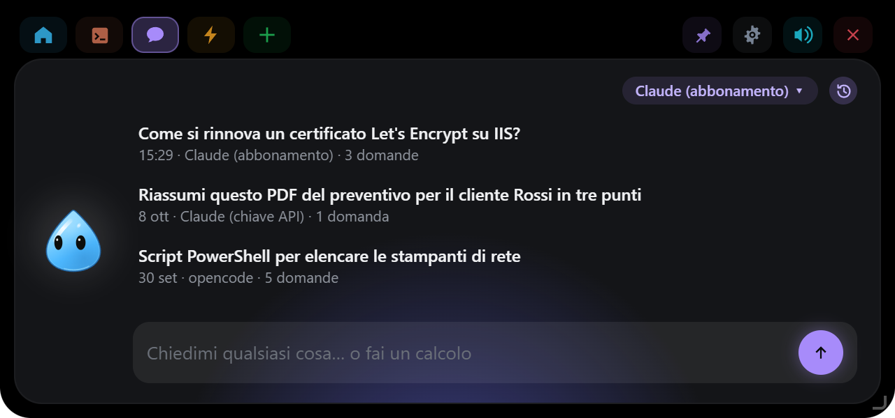

| Versione | Data | Novità |
|---|---|---|
| **0.6.7** | 10 ott 2026 | Risposta in markdown e «Continua» sulla card «finito», «Chiedi a questa sessione», «Più tardi» sul permesso, «Sempre» di sessione, 📌 come finestra normale |
| 0.6.6 | 10 ott 2026 | Saluto al centro dello schermo (o spento), `Ctrl+Space` apre e chiude, Claude Code solo con i suoi hook, niente falsi errori di rete dopo lo standby, passi della sessione senza sovrapposizioni |
| 0.6.5 | 9 ott 2026 | Cartella trascinata nella chat, menu col clic destro sul personaggio, saluto senza isola, `Ctrl+Space` sulla Panoramica, angoli arrotondati dell'isola staccata |
| 0.6.4 | 9 ott 2026 | Goccia predefinita, cronologia delle chat, isola fino ai bordi dello schermo, posizione dell'isola aperta |
| 0.6.3 | 9 ott 2026 | Interfaccia in inglese, `Ctrl+Space` per aprire l'isola, riepilogo settimanale degli agenti, limiti del piano Pro/Max, prezzi dei modelli |
| 0.6.2 | 9 ott 2026 | Barra di ricerca (integrazioni, azioni, programmi), file fissati nel Vassoio, azioni ⚡ senza selezione, «Chiedi alla chat» |
| 0.6.1 | 9 ott 2026 | Card «finito» da qualsiasi programma, cielo del Meteo sul personaggio, appunti lunghi nella card |
| 0.6.0 | 8 ott 2026 | opencode 2 come motore della chat e come agente, scheda Agenti per tutti gli agenti, pagine Chat e Agenti separate |
| 0.5.9 | 7 ott 2026 | Isola aperta ridimensionabile, loghi dei servizi, Panoramica riordinabile, cartelle delle azioni ⚡ |
| 0.5.8 | 6 ott 2026 | Vassoio dei file, consumo di Claude, Cursor e Copilot CLI, piano dell'agente e avvisi di rischio sui permessi |
| 0.5.7 | 5 ott 2026 | Azioni sul testo selezionato, Outlook senza PowerShell, registro delle chiamate 3CX |
| 0.5.6 | 5 ott 2026 | Chat con l'abbonamento: spiegato cosa serve (Claude Code da riga di comando) |
| 0.5.5 | 4 ott 2026 | Altri motori della chat e altri agenti, markdown nelle risposte, **Sempre** sui permessi, modifiche ai file in tempo reale |
| 0.5.4 | 4 ott 2026 | README completo e nuove schermate |
| 0.5.3 | 4 ott 2026 | Integrazione 3CX, isola aperta spostabile |
| 0.5.2 | 4 ott 2026 | Pillole e schede riordinabili trascinandole |
| 0.5.1 | 4 ott 2026 | Scorciatoie registrate premendo i tasti, Cattura una zona, immagini negli Appunti |
| 0.5.0 | 4 ott 2026 | Proposte di automazioni dalle tue abitudini |
| 0.3.0 | 4 ott 2026 | Automazioni, Claude che usa il PC dalla chat, calcolatrice, ZIP, schede delle integrazioni |
| 0.2.0 | 2 ott 2026 | Prima versione pubblica, aggiornamenti automatici |

---

## Installazione

**Il modo più semplice:** scarica `EasyIsland-Windows-X.Y.Z-setup.exe`
dall'[ultima release](https://github.com/EdoardoDevelop/easyisland/releases/latest)
ed eseguilo. L'installazione è solo per l'utente corrente: nessuna richiesta di
amministratore. L'installer non è ancora firmato, quindi Windows SmartScreen
mostra un avviso: clicca **Ulteriori informazioni → Esegui comunque**. Poi vai a
[Dopo l'installazione](#dopo-linstallazione). Gli aggiornamenti successivi
arrivano da soli (vedi [Aggiornare](#aggiornare)).

**Oppure compilalo sul tuo PC**, con i passi 1–4 qui sotto: alla fine si ottiene
lo stesso installer `.exe`. Ci vogliono circa 15–20 minuti la prima volta (quasi
tutti di download e compilazione), pochi minuti le volte successive.

### 1. Strumenti (solo la prima volta)

Apri **PowerShell** e installa i quattro strumenti con `winget`, già presente in
Windows 10/11:

```powershell
winget install --id Git.Git -e
winget install --id OpenJS.NodeJS.LTS -e
winget install --id Rustlang.Rustup -e
winget install --id Microsoft.VisualStudio.2022.BuildTools -e --override "--wait --passive --add Microsoft.VisualStudio.Workload.VCTools --includeRecommended"
```

| Strumento | A cosa serve |
|---|---|
| Git | scaricare il progetto |
| Node.js (LTS, 20 o più recente) | compilare l'interfaccia |
| Rust (rustup) | compilare l'app e il relay `easyisland-hook.exe` |
| Visual Studio Build Tools, carico "Sviluppo di applicazioni desktop con C++" | il linker e le librerie di Windows che usa Rust |

L'ultimo comando scarica alcuni GB e può richiedere parecchi minuti. WebView2,
che disegna l'interfaccia, è già incluso in Windows 10/11.

**Chiudi e riapri PowerShell** al termine, così i nuovi comandi (`git`, `npm`,
`cargo`) vengono trovati. Per controllare:

```powershell
git --version; node --version; cargo --version
```

### 2. Scarica il progetto

```powershell
cd $HOME
git clone https://github.com/EdoardoDevelop/easyisland.git
cd easyisland
```

> Se le modifiche più recenti sono ancora su un branch di sviluppo e non in
> `main`, passa a quel branch: `git checkout <nome-del-branch>`.

### 3. Compila l'installer

```powershell
npm install
npm run pack
```

`npm run pack` compila il relay, l'interfaccia e l'app, e alla fine lascia due
file nella cartella `release\`:

```
EasyIsland-Windows-X.Y.Z-setup.exe    l'installer con la versione
EasyIsland-Windows-setup.exe          lo stesso file con il nome fisso
```

### 4. Installa

```powershell
start .\release\EasyIsland-Windows-setup.exe
```

L'installer non è firmato, quindi Windows SmartScreen mostra un avviso: clicca
**Ulteriori informazioni → Esegui comunque**.

### Dopo l'installazione

EasyIsland si avvia e il personaggio ti saluta; da lì in poi lo trovi nel menu Start e
nell'area di notifica. Dall'icona di EasyIsland nell'area di notifica →
**Impostazioni…**:

1. **Agenti → Claude Code → Installa…** per vedere le sessioni
   nell'isola (vedi sotto). Funziona anche con l'app desktop di Claude.
2. **Chat**: scegli il motore. "Claude (abbonamento)" usa il tuo
   piano Pro o Max ma **richiede Claude Code da riga di comando** installato e con
   il login (vedi [Chat con Claude](#chat-con-claude)); altrimenti scegli una
   chiave API o un altro motore.
3. **Posizione e aspetto**: l'angolo e l'icona che preferisci.

### Aggiornare

**Da solo:** all'avvio e poi una volta al giorno EasyIsland guarda se su GitHub
c'è una release più recente. Se c'è, l'isola mostra **Aggiornamento
disponibile** con **Installa** / **Più tardi**: niente si installa senza il tuo
clic. L'aggiornamento è firmato e l'app ne verifica la firma prima di eseguirlo;
installando, si chiude e si riapre da sola. Si controlla anche a mano, o si
spegne il controllo, in **Impostazioni → Generale → Aggiornamenti**.

**Se l'hai compilato tu:**

```powershell
cd $HOME\easyisland
git pull
npm install
npm run pack
start .\release\EasyIsland-Windows-setup.exe
```

L'installer sostituisce la versione precedente; impostazioni e chiavi restano.

### Disinstallare

Prima, in **Impostazioni… → Agenti**, sulla riga di Claude Code clicca **Disinstalla…**: il
disinstallatore volutamente non tocca il `settings.json` di Claude Code. Poi
**Impostazioni di Windows → App → App installate → EasyIsland → Disinstalla**.

### Se qualcosa va storto

| Errore | Soluzione |
|---|---|
| `npm`, `cargo` o `git` "non riconosciuto" | chiudi e riapri PowerShell dopo l'installazione degli strumenti |
| `linker 'link.exe' not found` | mancano i Visual Studio Build Tools con il carico C++: rilancia l'ultimo comando `winget` del passo 1 |
| `error: toolchain 'stable-x86_64-pc-windows-msvc' is not installed` | `rustup default stable-msvc` |
| l'installer viene bloccato da Defender | è il falso positivo descritto sopra: usa "Esegui comunque", oppure lancia direttamente `target\release\easyisland.exe` |
| Il personaggio non compare | guarda nell'area di notifica (la freccia ^ accanto all'orologio) e il log in `%LOCALAPPDATA%\EasyIsland\easyisland.log` |
| le Impostazioni | sono divise in pagine (Generale, Aspetto, Notifiche, Claude, Azioni rapide, Automazioni, Integrazioni, Widget, Backup) nel menu a sinistra; la finestra ricorda l'ultima aperta |
| una chiave o una password "non si salva" | Gestione credenziali di Windows è piena (spesso di centinaia di token in cache di Xbox o di altre app) e rifiuta le voci nuove: le Impostazioni lo dicono sotto il campo. Elimina le voci che non servono da Pannello di controllo → Gestione credenziali → Credenziali generiche e riprova |
| vuoi aprire le impostazioni senza l'area di notifica | `"%LOCALAPPDATA%\EasyIsland\easyisland.exe" --settings` (anche come collegamento) |

## Come si usa


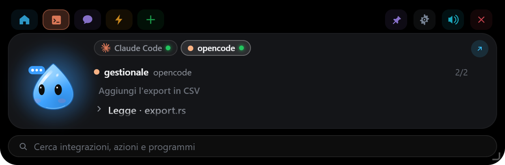


_Schermate generate dall'anteprima con `node scripts/screenshots.mjs` (serve `npm run dev` acceso), con dati di prova delle scene in `dev/scenes.ts`._

| Cosa fai | Cosa succede |
|---|---|
| Porti il mouse sull'icona del personaggio (in alto al centro, o nell'angolo che hai scelto) | Il personaggio si ingrandisce (o resta sempre così, con **Sempre visibile**), fa un balzo, ti guarda e alza una mano |
| Clicchi sul personaggio, o lasci il mouse sopra per un attimo se "Apri dopo" lo prevede | Si apre l'isola, allineata a quel lato |
| Trascini il personaggio tenendo premuto il tasto sinistro (anche l'icona a riposo) | Si sposta dove lo lasci, anche su un altro schermo, e la posizione resta salvata nel profilo |
| Trascini l'angolo in basso dell'isola aperta | Cambia larghezza e altezza dell'isola, fino ai bordi dello schermo; il contenuto si adatta. Doppio clic sull'angolo: misure predefinite |
| Scheda ⌂ **Panoramica** | Tutte le integrazioni con il loro stato e il loro logo; un clic ne apre una, trascinandole le riordini. Il personaggio mostra lo stato più urgente |
| Scheda **Agenti** (l'icona del terminale) | La sessione dell'agente di programmazione (Claude Code, Codex…): avanzamento, modifiche, permessi. L'aspetto della scheda (icona, logo di Claude, nome o emoji) si sceglie in Impostazioni → Agenti |
| Trascini l'isola aperta dallo spazio vuoto dell'intestazione | Resta lì finché è aperta; chiudendola torna al posto del personaggio |
| Trascini una pillola o una scheda in alto | Cambia posto (si blocca in Impostazioni → Integrazioni) |
| Clicchi sul personaggio | Si infastidisce. Tre volte di fila e gli gira la testa |
| Lasci il puntatore sul personaggio per due secondi | Cuori |
| Trascini un file sull'isola | Si apre anche se è impostata "solo con un clic": il personaggio diventa una scatola, lo inghiotte e poi si offre di rispondere a domande sul file |
| Clicchi l'orologio in alto nella chat | La **cronologia**: le conversazioni di prima, con data e motore; un clic ne riapre una e la continui da lì |
| `Esc`, o la ✕ in alto a destra | Chiude subito l'isola, senza aspettare i secondi della chiusura automatica |
| 📌 in alto a destra | **Tieni aperta**: l'isola non si chiude più da sola finché non la togli (Esc e ✕ la chiudono comunque) |
| Scrivi un calcolo nella chat, es. `840 + 22%` o `15% di 840` | Compare subito il risultato; **Invio** lo copia negli appunti, **Ctrl+Invio** chiede comunque alla chat. Il calcolo è fatto in locale, senza Claude |
| Rilasci uno ZIP | Oltre a "Fai una domanda" c'è **Estrai…**: vedi cosa contiene e lo estrai in una cartella nuova accanto all'originale, in Download o sul Desktop |
| Scheda **+** → **Cattura una zona** (o `Ctrl+Alt+Shift+S`) | Lo Strumento di cattura di Windows: scegli una zona, una finestra o lo schermo e la chat si apre con l'immagine allegata |
| Scheda **+** → **Vassoio** (o il pulsante **Vassoio** dopo aver rilasciato un file) | I file rilasciati sull'isola, in elenco o a griglia, tenuti finché EasyIsland non si riavvia, tranne quelli fissati con la puntina: trascinali in un'altra app (mail, chat, cartella), chiedi alla chat, apri, mostra nella cartella, fissa, togli uno o tutti. Sono copie: gli originali non vengono toccati |
| Scrivi nella **barra di ricerca** in fondo all'isola aperta | Trova integrazioni, sessioni degli agenti, azioni ⚡ e programmi installati (anche quelli dello Store); frecce per scegliere, **Invio** per aprire, **Esc** per svuotare. Si spegne in Impostazioni → Posizione e aspetto |
| Icona nell'area di notifica | Apri, Impostazioni…, Pausa, Esci |

Tutto il resto succede da solo: una richiesta di permesso di Claude Code apre
l'isola con **Nega / Consenti** (e **Sempre** quando Claude Code propone una regola
da ricordare: la card dice quale; anche sopra un'altra scheda; resta finché non
rispondi, poi l'isola torna dov'era), una sessione finita mostra l'ultimo messaggio
di Claude e le tue integrazioni stanno nelle pillole colorate accanto al personaggio. Non c'è un
numero massimo di integrazioni e widget: l'isola si allunga per mostrare tutte
le pillole e tutto il testo della scheda in primo piano (fino a circa 540 px,
poi le pillole scorrono).

**Modifiche in tempo reale:** mentre Claude Code lavora, ogni file che modifica
compare nei passi con le righe aggiunte in verde e tolte in rosso (`+12 −3`), e
sotto c'è il riepilogo della sessione. Un clic apre la scheda **Modifiche**: una
linguetta per file, ogni modifica con 3 righe di contesto e i numeri di riga, ↗
per aprire il file in VS Code alla riga cambiata. Il diff viene dai dati che
Claude Code passa all'hook, senza leggere il file; resta solo in memoria (50
modifiche al massimo, un'ora al massimo, cancellate a fine sessione). Oltre
200 KB o 4.000 righe si vede solo il bilancio.

## Posizione e aspetto

**Impostazioni… → Posizione e aspetto** decide dove vive il personaggio e quanto si fa notare:


- **Posizione**: in alto o in basso, a sinistra, al centro o a destra. Quando si
  apre, l'isola cresce dall'angolo scelto e il contenuto resta allineato a quel
  lato. Puoi anche **trascinare il personaggio** con il mouse dove vuoi: al rilascio la
  posizione resta salvata nel profilo, e il lato da cui si apre l'isola viene
  scelto da solo (il terzo e la metà dello schermo in cui lo lasci), così il
  pannello cresce verso l'interno. Vicino a un bordo o al centro si aggancia.
  Scegliere di nuovo una posizione qui lo riporta al bordo. Si trascina anche
  l'icona a riposo (un clic la apre). L'isola **aperta** si sposta tenendo premuto
  sullo spazio vuoto dell'intestazione: resta lì finché è aperta, poi alla chiusura
  torna scivolando al posto del personaggio e si riapre sempre da lì.
- **Schermo**: principale, quello sotto il cursore, oppure quello su cui hai
  trascinato il personaggio (se viene scollegato, torna sul principale).
- **L'isola si apre**: dove sta il personaggio (predefinito), oppure sempre **in
  alto al centro**, **al centro dello schermo** o **in basso al centro**. Il
  personaggio resta al suo posto; chiudendosi, l'isola torna da lui.
- **Larghezza** e **Altezza minima** dell'isola aperta, fino ai bordi dello
  schermo (anche trascinando il suo angolo in basso; *Predefinite* le riporta a
  640 px e all'altezza di ogni vista).
- **Sopra la barra**: il personaggio può stare anche sopra la barra delle applicazioni
  (spento: resta sopra di essa, nell'area di lavoro).
- **Aggancia ai bordi**: lasciato a pochi pixel da un bordo dello schermo, lo
  sfondo si attacca al bordo con gli angoli squadrati da quel lato; altrimenti è
  una bolla solo intorno all'icona. Spento: si attacca solo in alto al centro.
- **Vista compatta**: il personaggio più grande e animato, oppure la barra compatta
  con le integrazioni, con dimensione regolabile.
- **Segue il mouse**: se attivo, anche nella vista compatta il personaggio
  guarda il cursore. Spento (predefinito): si guarda intorno da solo, sbatte le
  palpebre e ogni tanto fa una smorfia, e consuma meno. A isola aperta segue
  sempre il mouse.
- **Sempre visibile**: la vista compatta resta sempre sullo schermo e non torna
  mai all'icona a riposo. Costa un po' di CPU (il personaggio è animato): sul portatile a
  batteria valuta se spegnerla.
- **Icona a riposo** e **Torna a riposo dopo** (solo se *Sempre visibile* è
  spenta): il personaggio fermo, un pallino con il colore dello stato, oppure nulla (solo
  una striscia invisibile sul bordo), e dopo quanti secondi tornarci. L'icona a
  riposo è un'immagine ferma: non consuma CPU.
- **Apri dopo**: quanto tenere il mouse sopra prima che si apra, oppure **solo
  con un clic**. Trascinare un file sopra il personaggio lo apre sempre.
- **Pannello aperto**: dopo quanti secondi dall'uscita del mouse il pannello si
  riduce alla vista compatta.
- **Pulsante chiudi**: la ✕ in alto a destra del pannello per chiuderlo subito.
- **Schermo intero**: durante video, giochi e presentazioni il personaggio sparisce; le
  richieste di permesso compaiono comunque.

Per provare le combinazioni senza compilare l'app (basta Node, niente Rust):

```powershell
npm install
npm run ui
```

Si apre il browser su un finto desktop: il riquadro tratteggiato è la finestra
di EasyIsland. Le impostazioni si cambiano nell'indirizzo, per esempio
`http://localhost:1420/?anchorV=bottom&anchorH=left&iconStyle=dot&iconSize=32&hoverSize=48&openDelay=1&revealDuration=3&bg=dark`.

## Azioni rapide e scorciatoie

**Impostazioni… → Azioni rapide** crea i pulsanti della scheda ⚡ dell'isola:

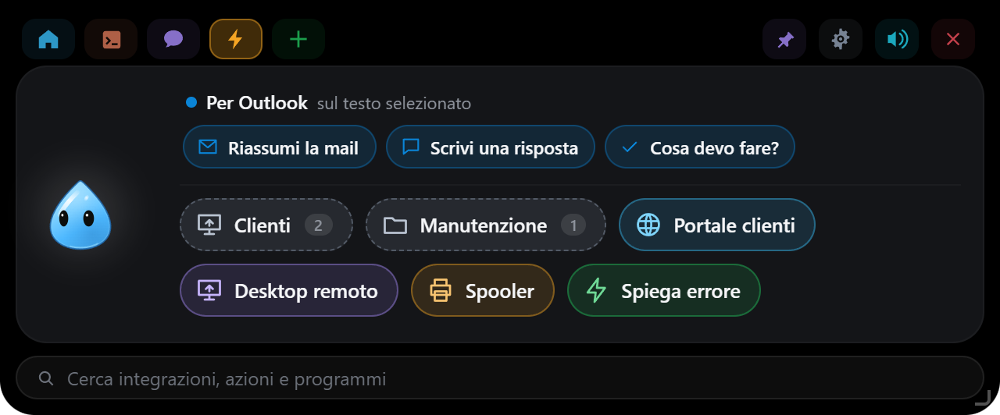

| Tipo | Cosa fa |
|---|---|
| **Chiedi alla chat** | manda un prompt salvato, applicato al testo copiato negli appunti o al file rilasciato sull'isola |
| **Script** | esegue comandi PowerShell o del Prompt dei comandi, nascosti, e mostra l'output nell'isola (con *Interrompi*, timeout di 5 minuti). Parte **solo dopo un clic**; con "Chiedi conferma" mostra prima i comandi |
| **Programma / cartella** | avvia un programma con i suoi argomenti (es. `mstsc /v:server01`) o apre una cartella |
| **Link** | apre un indirizzo nel browser |

**Cartelle**: ogni azione può stare in una cartella (campo *Cartella*, con
un'icona scelta dalla griglia). Nella scheda ⚡ le cartelle compaiono prima delle
altre azioni, con il numero di azioni dentro; un clic le apre, **‹** torna
indietro. Con più di 8 azioni compare **Cerca un'azione**: cerca anche dentro le
cartelle, Invio esegue la prima trovata.

**Suggerimenti per l'app in uso**: in cima alla scheda ⚡ compaiono azioni pronte
per l'app che stai usando, applicate al testo che hai selezionato: per Outlook
*Riassumi la mail*, *Scrivi una risposta*; per Excel *Spiega questi dati*; per
Word *Correggi*, *Rendi più formale*; per il browser *Riassumi*, *Traduci*; per
l'editor di codice *Spiega*, *Trova bug*; per il terminale *Spiega l'errore*; per
Teams e i PDF; per qualsiasi altra app *Riassumi*, *Traduci*, *Correggi*. Al clic
EasyIsland copia la selezione (e poi rimette negli appunti quello che c'era),
quindi apre la chat con il testo allegato. Si spegne in Azioni rapide.

Ogni azione si può riordinare con ↑ ↓ ed eliminare con ✕. L'icona si sceglie
con un clic sul riquadro a sinistra del nome, tra una cinquantina di icone
disegnate nel codice (terminale, cartella, sito, server, rete, lucchetto,
calendario, posta…); prende il colore dell'azione.

**Scorciatoie globali**, valide in ogni app (modificabili):

- `Ctrl+Space` apre l'isola sulle azioni (o sulla chat se non ce ne sono);
- `Ctrl+Alt+K` apre la chat con il testo (o l'immagine) copiato già allegato: scrivi la domanda;
- `Ctrl+Alt+H` apre la cronologia degli **Appunti** (se l'integrazione è accesa);
- `Ctrl+Alt+Shift+S` **cattura una zona dello schermo** (con lo Strumento di
  cattura di Windows: zona, finestra o schermo intero) e apre la chat con
  l'immagine allegata, per esempio per farsi spiegare una finestra d'errore.
  Si può fare anche dalla scheda **+** dell'isola, con **Cattura una zona**;
- `Ctrl+Alt+Shift+P` va alla **richiesta in attesa** (permesso o domanda) e dà la
  tastiera all'isola: `N` nega, `Y` consente, `S` sempre, `1`–`9` sceglie una risposta;
- `Ctrl+Alt+Shift+T` porta avanti l'**app della sessione** (terminale, VS Code,
  Cursor o l'app di Claude);
- **pillola successiva** e **suoni sì / no**: vuote di serie, si assegnano in
  Impostazioni → Azioni rapide;
- ogni azione può avere la sua scorciatoia, es. `Ctrl+Alt+E` per "Spiega errore".

**Nell'isola aperta da tastiera** (o nella chat): `←` `→` cambiano pillola,
`↑` `↓` scorrono la lista, `Ctrl+N` apre una nuova chat, `Ctrl+P` la tiene aperta,
`Esc` la chiude. Con il mouse l'isola non prende la tastiera, per non rubarla
all'app che stai usando.

Per cambiarne una basta un clic sul campo e premere la combinazione: il campo la
registra da solo (Esc annulla, Canc la toglie, ✕ la svuota). Mentre il campo è in
ascolto le altre scorciatoie sono sospese, così i tasti arrivano lì.
Se una scorciatoia è già usata da un'altra app, le Impostazioni lo segnalano.
Le azioni appartengono al profilo attivo; le scorciatoie Apri/Chiedi al PC.

## Integrazioni

**Impostazioni… → Integrazioni** accende le integrazioni, una per tipo, che
compaiono come pillole accanto al personaggio. Chiavi, token e indirizzi stanno in
Gestione credenziali di Windows.

Pillole e schede, comprese ⌂ 💬 ⚡ +, si **riordinano trascinandole** direttamente
nell'isola (un clic senza trascinare le apre come sempre). L'ordine vale per il profilo
attivo; in Integrazioni c'è **Blocca lo spostamento**, per non spostarle per
sbaglio, e **Ripristina l'ordine**.

| Integrazione | Cosa mostra |
|---|---|
| **GitHub, Vercel, Stripe, Resend, Notion, Cal.com, n8n** | l'attività del servizio (deploy, pagamenti, email, prenotazioni, esecuzioni), con la chiave del servizio |
| **Zammad** | ticket assegnati a te, non assegnati e in escalation; avvisa quando arriva un nuovo ticket da assegnare. Indirizzo e token di accesso (Profilo → Token di accesso, permesso `ticket.agent`) |
| **Outlook** | mail non lette e appuntamenti di oggi e domani da Outlook classico già aperto (non lo avvia mai); avvisa qualche minuto prima di una riunione. Il nuovo Outlook non è supportato |
| **Stato del PC** | spazio sul disco di sistema (arancione sotto la soglia, 10 %, rosso sotto il 5 %), memoria, batteria, da quanto è acceso, riavvio richiesto da Windows. Pulsante **Copia info PC**: nome, utente, Windows, modello, numero di serie, IP e MAC negli appunti, pronti per un ticket |
| **Sicurezza** | antivirus (Defender o un altro, dal Centro sicurezza di Windows), età delle firme, ultima scansione, firewall, minacce rilevate |
| **Rete** | Wi-Fi o cavo, IP locale e pubblico (api.ipify.org, al massimo ogni 15 minuti), VPN attive, latenza verso 1.1.1.1; avvisa se internet non risponde o è lento |
| **Meteo** | meteo attuale di una città (Open-Meteo, gratuito e senza chiave); avvisa se è probabile pioggia nelle prossime ore |
| **Appunti** | gli ultimi 30 testi e immagini copiati (fino a 10 immagini), più quelli fissati: clic per incollarli nell'app in primo piano, oppure copia, trasforma (MAIUSCOLO, minuscolo, una riga, senza spazi, JSON, URL), fissa, elimina; sulle immagini **Chiedi alla chat**. Solo in memoria, mai su disco; ciò che i gestori di password segnano come privato non viene registrato |
| **Musica** | cosa sta suonando in qualsiasi app che compare nei controlli multimediali di Windows (Spotify, il browser, Lettore multimediale…), con copertina, avanzamento e ⏮ ⏯ ⏭; la pillola mostra il titolo del brano. Tutto in locale |
| **3CX** | il centralino 3CX V20: chiamare (numero o ricerca in rubrica, da un dispositivo a scelta), chiamate in arrivo nell'isola con **Rispondi** / **Rifiuta**, **Riaggancia**, durata, stato, chiamate perse e recenti. Due accessi: **interno e password** (come l'app 3CX, senza licenze in più; accesso non documentato da 3CX) o un **client API** dell'Admin Console (licenza 8SC+; senza stato e cronologia). Numeri e nomi solo in memoria |

Ogni integrazione può stare tra le pillole della panoramica oppure in alto
nell'isola come **scheda**, con il suo nome o con un'icona a scelta ("Mostra
come"). Aprendo la scheda si vede solo quell'integrazione; le pillole restano
sulla scheda ⌂.

Quali integrazioni sono accese, e come sono mostrate, dipende dal profilo.

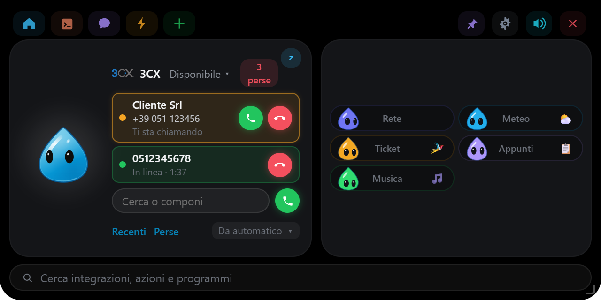
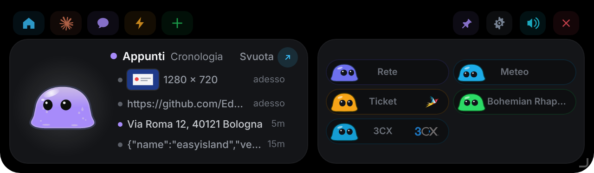
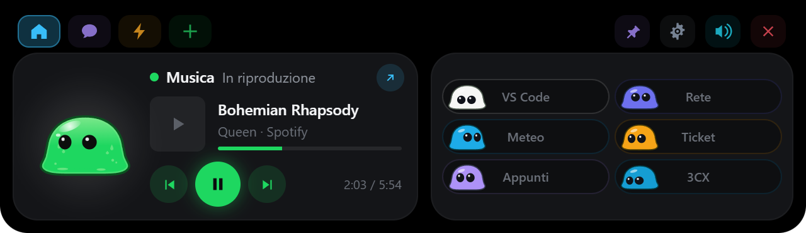
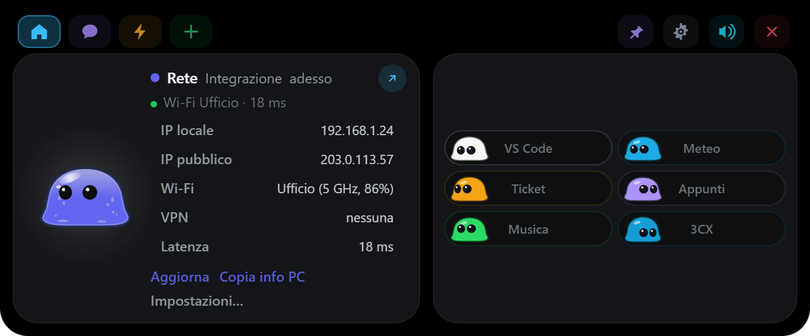
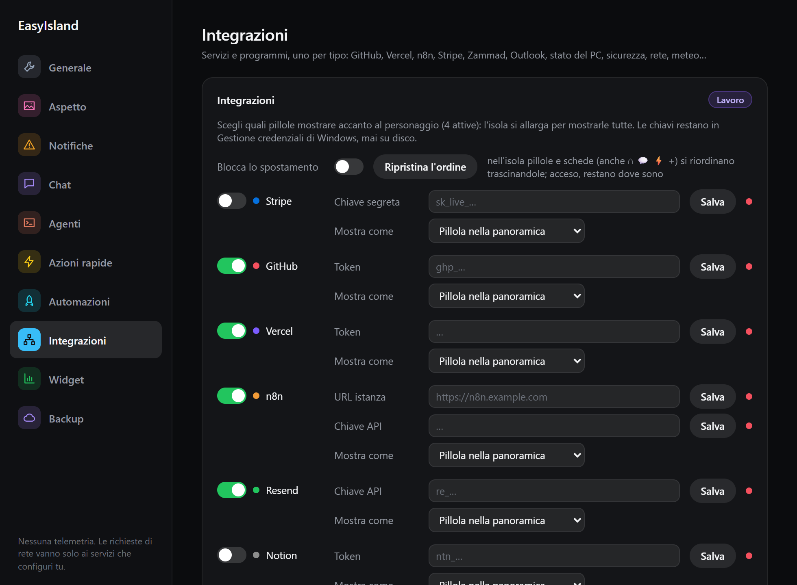

### 3CX

Chiamate, rubrica e chiamate in arrivo del tuo interno, dall'isola, su un
centralino **3CX V20**. In **Impostazioni → Integrazioni → 3CX** scegli
l'accesso:

- **Interno e password** (consigliato): EasyIsland entra come fa l'app 3CX, con
  l'indirizzo del centralino (es. `https://azienda.my3cx.it:5001`), il tuo interno
  o la tua e-mail e la password del web client. Nessuna licenza in più e niente
  da fare nell'Admin Console. È il modo in cui funziona il web client di 3CX, non
  un'interfaccia documentata: un aggiornamento del centralino potrebbe
  richiedere un aggiornamento di EasyIsland. La verifica in due passaggi non è
  ancora supportata.
- **Client API**: nell'Admin Console di 3CX, **Integrazioni → API → Aggiungi**,
  spunta *3CX Call Control API Access* (e *Configuration API Access* per la
  rubrica) e aggiungi il tuo interno tra quelli monitorati; in EasyIsland metti
  indirizzo, Client ID, chiave API e interno. Serve una licenza **8SC o
  superiore**. Stato e cronologia non sono disponibili in questo modo.

Nella scheda **3CX**:

- **Chiamare**: scrivi un numero o cerca un nome, un'azienda o un collega e
  clicca il numero; **Invio** chiama il primo risultato.
- **Dispositivo**: in fondo, **Da …** sceglie da dove parte la chiamata (app 3CX
  per Windows, telefono da scrivania, smartphone) oppure *automatico*.
- **Chiamate in arrivo**: l'isola si apre sulla scheda 3CX con un suono e resta
  aperta finché squilla, con **Rispondi** (se il dispositivo si può comandare a
  distanza, come l'app 3CX) e **Rifiuta**. Con "davanti al cliente" attivo compare
  solo il segnale sulla pillola, senza il nome di chi chiama.
- **In linea**: durata della chiamata e **Riaggancia**.
- **Stato** (Disponibile, Assente, Non disturbare…) dal menu accanto a "3CX",
  **chiamate perse** e **Recenti** (solo con interno e password).

EasyIsland resta collegato solo con l'integrazione accesa e non in pausa, e si
ricollega da solo se il collegamento cade. Numeri e nomi restano in memoria.

## Widget

**Impostazioni… → Widget** aggiunge controlli ripetibili, quanti ne servono
(un sito per cliente, un server per sede…), senza scrivere codice:

| Tipo | Cosa controlla |
|---|---|
| **Calendario** | i prossimi appuntamenti da un link ICS (Google Calendar, Outlook.com, iCloud), senza login; avvisa qualche minuto prima. Il link è segreto e sta in Gestione credenziali |
| **Scadenza domini** | i giorni alla scadenza di uno o più domini (RDAP, o WHOIS per i registri che non lo hanno, come .it) |
| **Sito web** | che un indirizzo risponda (stato 2xx/3xx o quello che indichi) e in quanto tempo |
| **Certificato HTTPS** | i giorni alla scadenza del certificato di un dominio: arancione sotto la soglia (30 giorni), rosso sotto i 7 o se scaduto |
| **Ping** | che un host risponda al ping (senza diritti di amministratore) |
| **Porta TCP** | che una porta sia aperta, es. 3389 (Desktop remoto), 22, 443 |
| **Servizio Windows** | che un servizio locale sia in esecuzione, es. `Spooler` |
| **API JSON** | qualsiasi API: scegli i campi da mostrare (percorso tipo `data.items[0].stato`) e una regola di avviso (es. `aperti > 10`). Le intestazioni segrete (token, chiavi) vanno in Gestione credenziali |

Quando un controllo (widget o integrazione come Stato del PC, Rete, Outlook…)
passa da OK a problema, la pillola prende un badge, il personaggio suona e l'isola si fa
vedere (secondo le regole di notifica del profilo). Il pulsante ▶ prova un widget
subito. I controlli si fermano con EasyIsland in pausa e diventano tre volte più
radi a batteria. I widget appartengono al profilo.

## Davanti al cliente

**Impostazioni… → Notifiche → Davanti al cliente**: il personaggio si fa da parte quando
qualcuno potrebbe vedere il tuo schermo.

- **Durante le chiamate**: microfono o webcam in uso da qualsiasi app (Teams,
  Zoom, Meet nel browser, Webex…). EasyIsland lo legge da dove Windows annota chi li
  sta usando, senza bisogno dell'API di Teams.
- **Durante l'assistenza**: qualcuno è collegato a questo PC (Desktop remoto,
  Assistenza rapida, TeamViewer), più i programmi che aggiungi tu.
- **A mano**: icona nell'area di notifica → **Davanti al cliente**.
- **Cosa fa**: nasconde il personaggio e silenzia i suoni (le richieste di permesso di
  Claude Code compaiono comunque), oppure solo silenzio.

## Messaggi dagli script

Qualsiasi script, attività pianificata, flusso n8n o programma può mostrare un
messaggio sull'isola:

```powershell
& "$env:LOCALAPPDATA\EasyIsland\bin\easyisland-hook.exe" notify "Backup" "Completato in 4 minuti" --stato ok
```

`--stato` è `ok`, `avviso`, `errore` o `info`; `--apri https://…` aggiunge un
pulsante con un link; `--help` mostra l'aiuto. Esce con 0 se il messaggio è
arrivato e con 2 se EasyIsland non è in esecuzione, quindi uno script non resta mai
bloccato. Valgono le regole di notifica del profilo. In **Impostazioni… →
Notifiche** c'è il comando pronto da copiare e un pulsante **Prova**.

## Profili, tema e backup

**Lingua** (Impostazioni → Generale): come Windows, italiano o inglese. Vale
dal riavvio, offerto con **Riavvia ora**; anche la chat risponde in quella lingua.

**Impostazioni… → Profilo**: ogni profilo (di partenza *Lavoro*, *Casa* e
*Concentrazione*) ha le sue integrazioni, posizione, aspetto, suoni, tema e
regole di notifica. Le sezioni con l'etichetta viola si salvano nel profilo
attivo.

- Si cambia profilo dalle Impostazioni o dal menu dell'icona nell'area di
  notifica (**Profilo ▸**).
- **Cambio automatico**: ogni profilo può avere regole su rete Wi-Fi, giorni e
  orario (es. *Lavoro* sulla Wi-Fi dell'ufficio, lun–ven 8–18). Ogni minuto
  EasyIsland attiva il primo profilo che corrisponde; una scelta fatta a mano resta
  finché la situazione non cambia.
- **Notifiche**: tutto, solo avvisi, oppure solo le richieste di permesso
  (com'è *Concentrazione* all'inizio).
- **Tema**: il personaggio (**Goccia**, la predefinita, **Slime** o **EasyTech**), il suo
  colore, colore e opacità dell'isola, **sfondo a isola chiusa** (spento, a
  isola chiusa resta solo il personaggio, senza il cerchio o la barra), volume
  separato per avvisi, interfaccia ed emozioni. Slime è uno slime di gelatina verde che ondeggia quando si
  muove; Goccia è un piccolo spirito d'acqua azzurro, lucido, a forma di goccia;
  EasyTech è un cubo, a riposo con i colori del logo da cui è disegnato (o con il
  colore del tema, se lo scegli). Negli
  altri stati tutti prendono il colore dello stato (blu mentre lavora, ambra per
  un permesso, rosso per un errore…). EasyTech ha gli occhi su un lato, con le
  stesse espressioni, e segue il mouse come gli altri. Anteprima senza
  compilare: `npm run ui`, poi aggiungi `?character=drop` o `?character=cube`
  all'indirizzo.
- **Backup e trasferimento**: *Esporta…* salva tutte le impostazioni (profili
  compresi) in un file JSON nella cartella Documenti; *Importa…* le carica su un
  altro PC. Le chiavi API non sono mai nel file: vanno reinserite.

## Claude Code

Apri **Impostazioni… → Agenti** e sulla riga di Claude Code clicca **Installa…**. Vedi il diff esatto di cosa
cambierà in `%USERPROFILE%\.claude\settings.json` e il percorso della copia di
backup datata che verrà creata. Non viene scritto nulla finché non clicchi. I tuoi
hook non vengono mai toccati e la disinstallazione rimuove solo le voci di EasyIsland.

Il relay è un piccolo eseguibile, `easyisland-hook.exe`, copiato in
`%LOCALAPPDATA%\EasyIsland\bin\` all'avvio. Ha 300 ms per raggiungere EasyIsland ed esce
in modo pulito se l'app è chiusa, lenta o crashata: **una sessione di Claude Code
non viene mai bloccata né rallentata da EasyIsland.** Se nessuno risponde in tempo a
una richiesta di permesso, EasyIsland resta in silenzio e Claude Code la chiede nel
terminale come al solito.

Funziona da qualsiasi terminale: Windows Terminal, PowerShell, VS Code, Git Bash,
e nel terminale di **Cursor** ("Apri" riporta a Cursor).

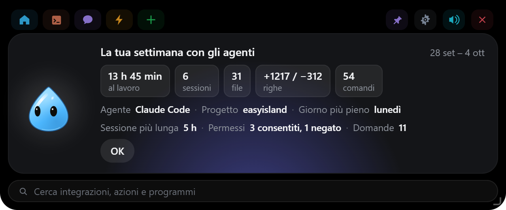

**Riepilogo settimanale**: il lunedì dalle 8 l'isola mostra la settimana prima
degli agenti (ore al lavoro, sessioni, file e righe cambiati, comandi, permessi);
anche dal menu dell'icona nell'area di notifica. Tiene solo i conteggi e il nome
della cartella del progetto, mai comandi o contenuti. **Limiti del piano** (Pro e
Max): la card Consumo mostra le percentuali delle 5 ore e della settimana, con un
avviso dall'80 %; arrivano dalle sessioni nel terminale o in VS Code dopo
«Aggiorna» degli hook.

**Codex, opencode e Gemini CLI.** Nella stessa pagina (Impostazioni → Agenti) ci sono
i loro hook, installati con le stesse regole: diff, backup datato, conferma.
Ogni agente ha la sua pillola con passi, modifiche ai file e ultimo messaggio.

- **Codex** (`%USERPROFILE%\.codex\hooks.json`): anche le richieste di permesso,
  con **Consenti / Nega** nell'isola. Dopo l'installazione apri `/hooks` in Codex e
  approva gli hook di EasyIsland (Codex chiede di fidarsi degli hook nuovi).
- **opencode**: con opencode 2 accendi **Collega opencode**. EasyIsland legge il
  servizio in background di opencode sul tuo PC, senza installare nulla. Le
  richieste di permesso arrivano nell'isola con **Consenti / Nega / Sempre**, e
  puoi rispondere anche in opencode come sempre. Con opencode 1.x c'è invece un
  plugin (`%USERPROFILE%\.config\opencode\plugins\easyisland.js`); dopo
  l'installazione riavvia opencode.
- **Gemini CLI** (`%USERPROFILE%\.gemini\settings.json`): Gemini non lascia
  rispondere ai permessi da fuori, quindi l'isola si apre e ti dice che sta
  aspettando, con il pulsante per tornare al terminale.

**Altri strumenti.** Qualsiasi programma può avere la sua pillola mandando gli eventi
a `easyisland-hook <Evento>` con un campo `easyisland_agent`:
`{"id": "mio-bot", "name": "Il mio bot", "color": "#22C55E"}` (gli eventi e i campi
sono quelli degli hook di Claude Code).

## Chat con Claude

**Impostazioni… → Chat** ti fa scegliere il motore **predefinito**
della chat. Dal nome del modello in alto a destra nella chat puoi sceglierne un
altro solo per quella conversazione (il menu mostra solo i motori pronti):

- **Abbonamento Claude (tramite Claude Code)**, il predefinito. EasyIsland usa
  Claude Code installato sul PC (`claude -p`, nascosto, senza finestre) e il tuo
  abbonamento Pro o Max: nessuna chiave e nessun costo extra, ma le domande
  contano nei limiti d'uso del piano.

  > **Serve Claude Code da riga di comando (la CLI), con il login fatto.**
  > L'app desktop di Claude da sola non basta: il suo Claude Code è chiuso
  > dentro l'app e usa il login dell'app, che gli altri programmi non possono
  > usare. Lo stesso vale per quello dell'estensione di VS Code, che di solito
  > non ha un login suo. Per installare la CLI, una volta sola:
  >
  > 1. in PowerShell: `irm https://claude.ai/install.ps1 | iex`
  > 2. chiudi e riapri PowerShell, scrivi `claude` e accedi con il tuo account
  >    Claude (Pro o Max);
  > 3. in Impostazioni → Chat premi **Ricontrolla**: il pallino
  >    diventa verde.
  >
  > Le sessioni di Claude Code nell'isola (permessi, modifiche…) invece
  > funzionano anche solo con l'app desktop: passano dagli hook.

  Claude Code gira in una cartella vuota
  (`%LOCALAPPDATA%\EasyIsland\chat`), con gli hook disattivati e solo con ricerca
  web, lettura di pagine web e lettura dei file che rilasci.
- **Chiave API Anthropic**. EasyIsland chiama direttamente l'API con la tua chiave,
  pagata a consumo dalla Console di Anthropic.
- **OpenRouter** (una chiave per centinaia di modelli), **OpenAI** e **Gemini**
  (Google AI Studio): la chiave va in Gestione credenziali, il modello si sceglie
  dall'elenco (**Carica modelli**). Si paga a consumo da loro.
- **Ollama** e **LM Studio**: modelli sul tuo PC (o su un altro della rete), nessuna
  chiave, solo l'indirizzo (vuoto = quello predefinito). Nulla esce dalla rete.
- **opencode** (serve opencode 2 sul PC): modelli gratuiti di opencode Zen, locali
  (Ollama, LM Studio) o dei fornitori collegati in opencode, **con strumenti**. Il
  modello può eseguire comandi, leggere e modificare file e cercare sul web, e ogni
  comando, modifica o accesso al web chiede **Consenti / Nega** nell'isola
  (**Sempre** solo per i comandi che leggono soltanto); se non rispondi è un no.
  EasyIsland avvia un server privato di opencode solo mentre chatti, lo spegne dopo
  10 minuti e lavora in `%LOCALAPPDATA%\EasyIsland\opencode`. Il modello si scrive
  come `fornitore/modello` (**Carica modelli**). Le chiavi dei fornitori restano in
  opencode (`opencode auth login`). **Attenzione ai modelli gratuiti online:** per
  quasi tutti i dati possono essere usati per migliorare il modello, quindi
  niente dati dei clienti; per quelli usa un modello locale.

Con OpenRouter, OpenAI, Gemini, Ollama e LM Studio la risposta compare mentre arriva e il "ragionamento" dei
modelli che lo mostrano resta nascosto; non hanno strumenti (niente ricerche sul
web né azioni sul PC). Le immagini vanno ai modelli che le leggono, i file di testo
nel messaggio; i PDF solo con Claude.

**Connettori** (Impostazioni → Chat, solo con "Abbonamento Claude"): la chat può usare i
server MCP che hai configurato in Claude Code per l'utente
(`claude mcp add --scope user …`), scegliendo quali profilo per profilo. Con
"chiedi conferma" (predefinito) ogni operazione su quel connettore compare
nell'isola con **Consenti / Nega**; disattivala solo per i connettori di sola
lettura. EasyIsland legge solo i nomi dei server, mai la loro configurazione. I
connettori di claude.ai non sono disponibili quando Claude Code gira in questo
modo.

Le chiavi stanno in **Gestione credenziali di Windows**, mai su disco e mai
nell'interfaccia: l'isola può solo chiedere se una chiave esiste. Lo stesso vale
per le chiavi di ogni integrazione.

Alla chat si può allegare il testo copiato o un'immagine (`Ctrl+Alt+K`), un file
rilasciato sull'isola, una **zona dello schermo** (`Ctrl+Alt+Shift+S` o scheda
**+**) o un'immagine della cronologia Appunti (**Chiedi alla chat**).

La chat risponde nella lingua dell'interfaccia, a meno che tu non gli scriva in un'altra lingua.
**Nuova chat**, a sinistra del campo di testo, dimentica la conversazione (e il
file o il testo a cui si riferiva) e ne comincia una da zero.

**Cronologia**: l'orologio in alto nella chat mostra le conversazioni di prima
(fino a 100, salvate solo su questo PC in `%LOCALAPPDATA%\EasyIsland\chats.json`).
Un clic ne riapre una sul suo motore e la continui: con chiave API, OpenRouter,
OpenAI, Gemini, Ollama e LM Studio riprende esattamente da dove era; con
l'abbonamento e con opencode la conversazione di prima viene passata come testo
insieme alla nuova domanda. I file allegati non vengono salvati. Impostazioni →
Chat → **Cronologia** la spegne (e la cancella) o la svuota.

Con "Abbonamento Claude", EasyIsland cerca Claude Code nel `PATH`, in
`%USERPROFILE%\.local\bin` e nella cartella di npm; se non c'è un'installazione
a sé, usa la copia inclusa nell'app desktop di Claude
(`%APPDATA%\Claude\claude-code\<versione>`) o nell'estensione per VS Code,
sempre la versione più recente.

Nessuna telemetria. Le richieste di rete di EasyIsland vanno ai servizi che
configuri tu, più una sola altra: il controllo degli aggiornamenti, che legge un
file della release su GitHub (si spegne in Impostazioni → Generale →
Aggiornamenti).

## Automazioni

**Impostazioni… → Automazioni**: quando succede qualcosa, EasyIsland fa
qualcosa per te.

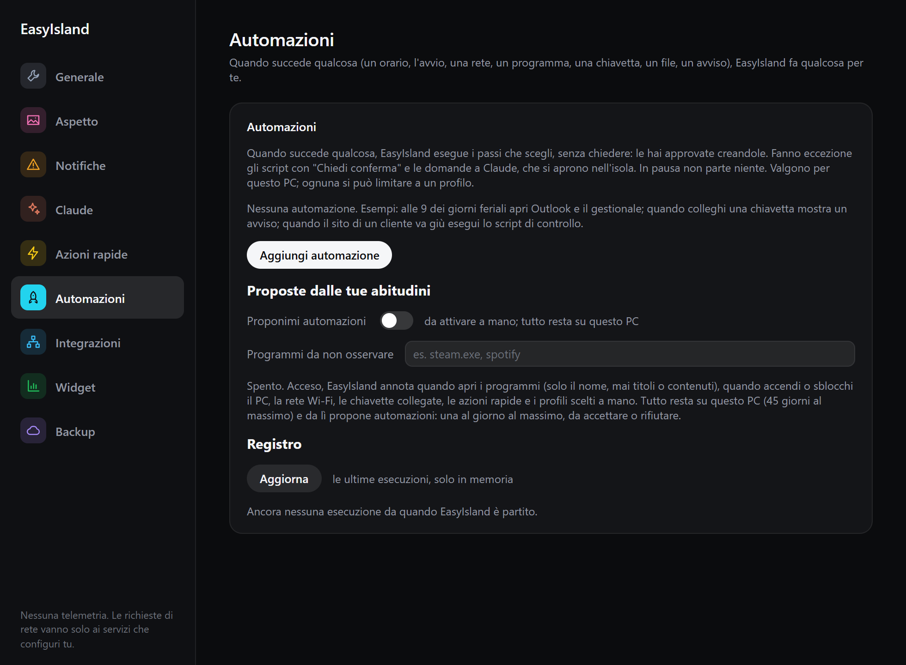

| Quando | Esempio |
|---|---|
| a un orario, nei giorni scelti | alle 9 dei giorni feriali apri Outlook e il gestionale |
| all'avvio (con il PC) | dopo 30 secondi passa al profilo Lavoro |
| quando sblocchi il PC | mostra un avviso con il promemoria del giorno |
| quando ti colleghi a una rete Wi-Fi | in ufficio apri la cartella condivisa |
| quando parte un programma | quando apri Teams, esegui l'azione "Silenzia" |
| quando colleghi una chiavetta o un disco | esegui lo script di backup |
| quando arriva un file in una cartella | avvisami delle nuove scansioni |
| quando un'integrazione o un widget segnala un problema o una novità | se il sito del cliente va giù, esegui lo script di controllo; nuovo ticket → avviso |

Si possono anche **chiedere a Claude a parole** nella chat (con l'abbonamento):
"ogni giorno feriale alle 9 apri Outlook e il gestionale", "quando colleghi una
chiavetta lancia il backup". Claude prepara l'automazione e l'isola te la mostra
(Quando… / Allora…) con **Consenti / Nega**: confermando, viene creata e accesa.

**Allora** è una sequenza di passi: un'azione rapida, un avviso nell'isola, il
cambio di profilo, aprire un programma o una cartella, aprire un link. Ogni
automazione si può limitare a un profilo e provare subito con **Prova ora**;
il **Registro** mostra le ultime esecuzioni. Partono senza chiedere, perché
le hai create tu, tranne gli script con "Chiedi conferma" e le domande a
Claude, che si aprono nell'isola. Con EasyIsland in pausa non parte niente.

### Proposte dalle tue abitudini

Se lo attivi (**Automazioni → Proponimi automazioni**, spento di serie),
EasyIsland annota quando apri i programmi (solo il nome, mai titoli o
contenuti), quando accendi o sblocchi il PC, la rete Wi-Fi, le chiavette, le
azioni rapide e i profili scelti a mano. Tutto resta su questo PC, al massimo
45 giorni, e si cancella con un clic. Dopo qualche settimana propone
automazioni, per esempio *"Apro Outlook alle 8:50?"* perché lo apri sempre a
quell'ora nei giorni feriali: **Crea**, **Non ora** (te la ripropone tra un
mese) o **No, mai** (non te la ripropone più, ma la ritrovi tra le *Proposte
rifiutate* se cambi idea). Propone anche le sequenze (*"Quando apri il gestionale, apro anche Excel?"*)
e, se un'automazione nata da una proposta non ti serve più (apre un programma
che poi non usi), ti chiede se spegnerla. In **Programmi da non osservare**
indichi quelli da ignorare. Al massimo una proposta al giorno.

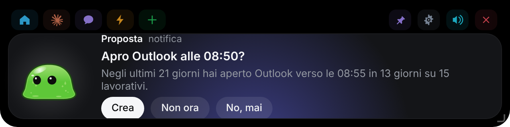

### Claude può usare il PC

Con l'abbonamento (motore Claude Code), nella chat Claude può anche agire su
questo PC tramite EasyIsland: aprire programmi, cartelle e link, eseguire le
tue **azioni rapide** (anche gli script, di cui legge l'output), leggere lo
stato di PC, rete, meteo, posta e ticket, leggere o riempire gli appunti,
controllare la musica, mostrare un avviso, cambiare profilo. Esempi: "apri
Outlook e il portale fornitori", "com'è messo il PC?", "lancia il backup".

Tutto ciò che apre, esegue o cambia qualcosa chiede prima **Consenti / Nega**
nell'isola, con una descrizione chiara di cosa sta per fare. Claude non può
eseguire comandi qualsiasi: solo le azioni rapide che hai creato tu. Si spegne
in **Impostazioni → Chat → Può usare il PC**.

## Compilarlo da te

Per chi lavora sul codice. Gli strumenti sono gli stessi del passo 1 di
[Installazione](#installazione).

```powershell
npm install
npm run tauri dev      # l'app vera, con ricaricamento automatico dell'interfaccia
npm run ui             # solo l'interfaccia nel browser (non serve Rust)
npm run build          # controllo dei tipi + build dell'interfaccia
npm run pack           # crea l'installer e lo mette in release/
```

`npm run ui` serve il front end in un normale browser senza compilare nulla in
Rust, che basta per lavorare all'aspetto dell'isola (vedi "Posizione e aspetto").
Serve anche `dev/upload-preview.html`, che
ripete in loop tutta la coreografia del rilascio di un file: è l'unica parte
dell'interfaccia che altrimenti richiede un vero trascinamento da Esplora file.
Nessuna delle due pagine finisce nell'app.

`npm run pack` lascia due file in `release/`, con gli stessi nomi che pubblica la
workflow di release:

```
EasyIsland-Windows-X.Y.Z-setup.exe    l'installer con la versione
EasyIsland-Windows-setup.exe          lo stesso file con il nome fisso
```

Installare è facoltativo: `target/release/easyisland.exe` funziona da solo. Non c'è
nessuna finestra nella barra delle applicazioni e nessuna console: l'isola in cima
allo schermo e l'icona nell'area di notifica sono tutta l'app, ed Esci sta nel
suo menu.

I 28 suoni sono generati nel codice, in `src/core/synth.ts`: nessun file audio.
Per ascoltarli e ritoccarli: `npm run dev`, poi `/dev/sounds-preview.html`.

L'icona dell'app e quella dell'area di notifica sono disegnate nel codice: sono
l'isola stessa, uguale qualunque personaggio tu scelga:

```powershell
npm run icons          # rigenera src-tauri/icons da scripts/gen-icons.mjs
```

### Pubblicare una versione

1. Alza la versione, uguale, in `package.json`, `Cargo.toml` e
   `src-tauri/tauri.conf.json` (la CI controlla che coincidano), e fai il commit.
2. Crea e invia il tag:

   ```powershell
   git tag vX.Y.Z
   git push origin vX.Y.Z
   ```

3. La workflow **Build** compila l'installer, lo firma per l'aggiornamento e
   pubblica la release con `EasyIsland-Windows-X.Y.Z-setup.exe`, la sua firma
   (`.sig`) e `latest.json`, il file che le app installate leggono per
   aggiornarsi.

Serve una volta sola il secret **`TAURI_SIGNING_PRIVATE_KEY`** del repository
(Settings → Secrets and variables → Actions), con il contenuto della chiave
privata creata con `npx tauri signer generate`; la chiave pubblica è in
`tauri.conf.json`. Se la chiave privata va persa, le app installate non
accettano più aggiornamenti firmati con una nuova: andrebbero reinstallate a
mano. Tienine una copia al sicuro.

### Struttura

```
./
  src/                 front end dell'isola (TypeScript, nessun framework)
    character/         i personaggi (Slime, Goccia, EasyTech) e il saluto all'avvio, in Canvas 2D
    island/            macchina a stati, hook, integrazioni
    views/             tutte le viste dell'isola
    settings/          la finestra delle impostazioni
  src-tauri/           backend Rust: finestra, named pipe, API Claude, integrazioni, 3CX, automazioni
  hook/                easyisland-hook.exe: il relay per Claude Code e il connettore MCP "easyisland"
  scripts/             icone, impacchettamento dell'installer, schermate del README
  dev/                 anteprime nel browser (personaggi, suoni, rilascio) e scene delle schermate
  screenshots/         le immagini di questo README
```

### Log

`%LOCALAPPDATA%\EasyIsland\easyisland.log`: eventi degli hook, decisioni sui permessi,
problemi dei poller. Resta sul tuo computer.

## Origine

EasyIsland nasce come fork solo per Windows di
[Louis-CFM/coucou](https://github.com/Louis-CFM/coucou) (Coucou, con il
personaggio Mochi), app nativa macOS per il notch. Slime, uno slime,
ha preso il posto di Mochi. Il codice macOS e il prototipo originale sono stati
rimossi (restano nella storia git). Alcune funzioni
esistevano solo sul Mac e non sono presenti qui: invio di un file per email,
trascinamento di Slime su una finestra per allegarla come contesto, salto alla
finestra esatta del terminale. Al suo posto, quando una sessione finisce o va
in errore, il pulsante **Apri Claude / Apri VS Code / Apri terminale** riporta in
primo piano l'app in cui gira la sessione (l'app desktop di Claude, VS Code con
la cartella del progetto, Windows Terminal o la console); se non la trova apre
la cartella in VS Code, e altrimenti in Esplora file.

Licenza: MIT per il codice. Nomi, personaggi, icone e suoni di EasyIsland sono
nuovi; quelli dell'originale (non più usati) restano riservati al suo autore: vedi
`LICENSE-ASSETS.md`.
